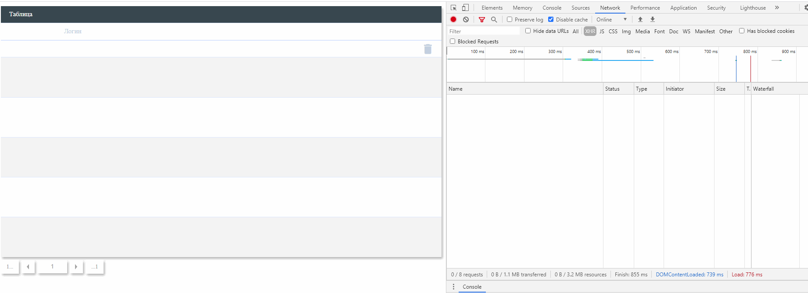

# GithubApi



## Demo:

[https://asosunoff.github.io/GithubApi/](https://asosunoff.github.io/GithubApi/)

### Launch project:

```
git clone https://github.com/aSosunoff/GithubApi.git
cd GithubApi
npm i
npm run start
```

### Test project:

```
npm test
```
